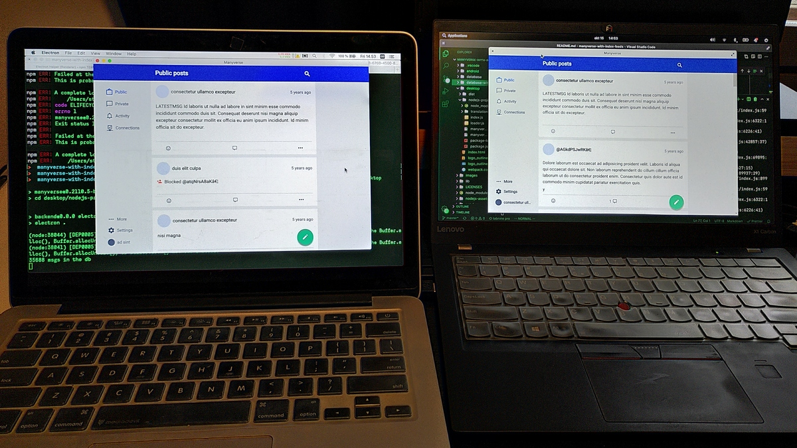

<!--
SPDX-FileCopyrightText: 2021 The Manyverse Authors

SPDX-License-Identifier: CC-BY-4.0
-->

## Manyverse fork with index feeds

This repo is a fork of [Manyverse](https://github.com/staltz/manyvrese) to add
metafeeds and index feeds and benchmark the performance of secure partial
replication in an end-to-end environment.

## Setup



> Bob on a Mac Book Pro recovering all data from Alice on a Thinkpad Carbon X1.
>
> Timer starts when the connection is displayed on the Connections tab, and is
> stopped when the Public tab has stopped showing indicator of new messages.

First, generate the fixtures (see sections Before and After).

Then, build and run Manyverse desktop:

```
npm install
```

```
npm run build-desktop
```

```
SSB_DIR=database npm run desktop
```

First run Manyverse desktop with `SSB_DIR=database npm run desktop` on "Alice" so she can migrate flume to ssb-db2, and make sure that it is fully migrate. Then delete
`database/flume` folder, and restart Alice.

Open up Bob's Manyverse desktop and with `SSB_DIR=database npm run desktop` on a `database` folder that **only** has Bob's `secret` file.

# Full replication

> Without index feeds
>
> Manyverse "master" branch. No CPU load throttling.

```
npx ssb-fixtures --seed=apple --messages=100000 --authors=1000 \
--slim --allkeys --followGraph --report --progress \
--outputDir=database
```

Results of repeated runs:

| Round | Duration | Message count | Msgs / s |
|-------|----------|---------------|----------|
| #1 | 127s | 48528 | 382 |
| #2 | 124s | 50444 | 406 |
| #3 | 121s | 49829 | 411 |
| **Average** | **124s** | **49600** | **399** |

# Partial replication

> With ssb-meta-feeds, ssb-replication-scheduler setup with templates
>
> Alice's partial replication template is:
> - Hops 0+: main + all indexes
>
> Bob's partial replication template is:
> - Hops 0: main + all indexes
> - Hops 1: post,vote,contact,about,private indexes
> - Hops 2+: contact,about indexes
>
> No CPU load throttling.

```
npx ssb-fixtures --seed=apple --messages=100000 --authors=1000 \
--slim --allkeys --followGraph --report --progress \
--indexFeeds=100 --indexFeedTypes=post,vote,contact,about,private \
--outputDir=database
```

Results of repeated runs:

| Round | Configs | Duration | Message count | Msgs/s |
|-------|---------|----------|---------------|--------|
| #1 | Default | 515s | 30579 | 59 |
| #2 | replicationScheduler debouncePeriod 0 | 420s | 31861 | 75 |
| #3 | replicationScheduler debouncePeriod 0 and db2.addDebounce 10 | 368s | 31665 | 86 |
| #4 | replicationScheduler debouncePeriod 0 and db2.addDebounce 10 | 267s | 31759 | 118 |
| **Average** | | **392s** | **31466** | **85** |
